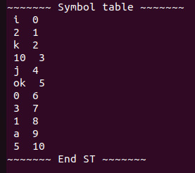
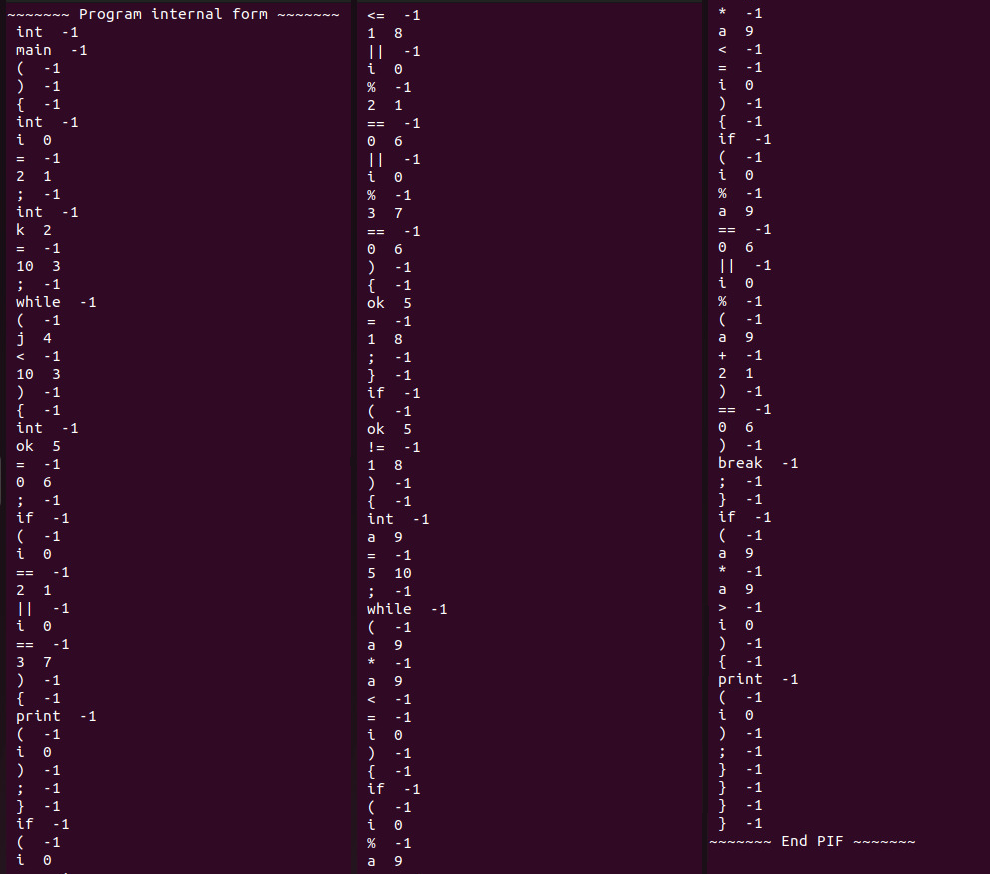

# LFTC_lab2

Statement: Use lex to perform scanning for your programming language

The scanner input will be a text file containing the source program, and will produce as output the following:

- PIF - Program Internal Form

- ST - Symbol Table

```
lex lexical_analyzer.l
gcc lex.yy.c
./a.out problem.txt
```




